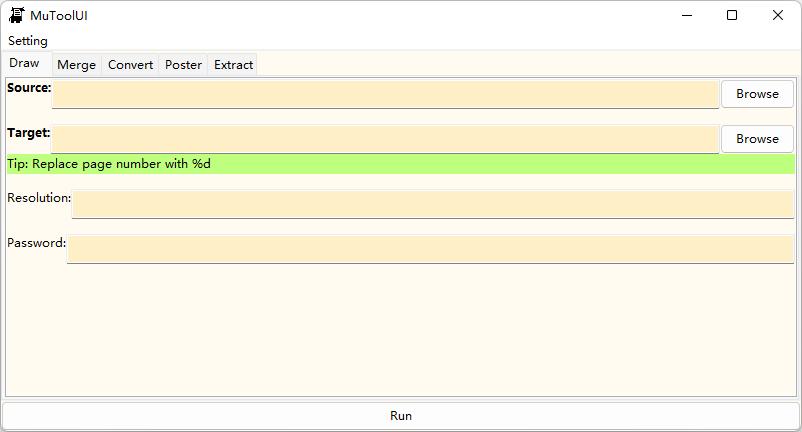
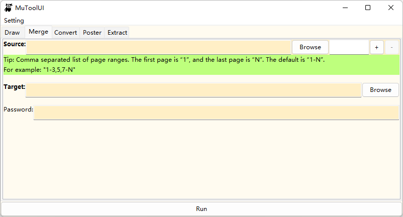
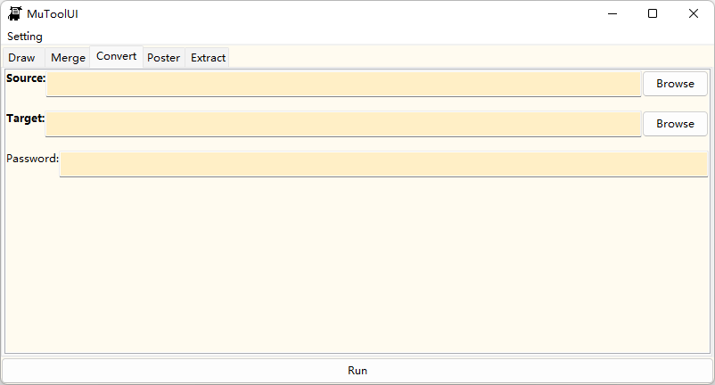
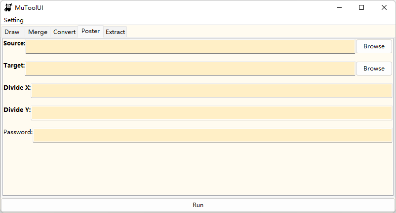
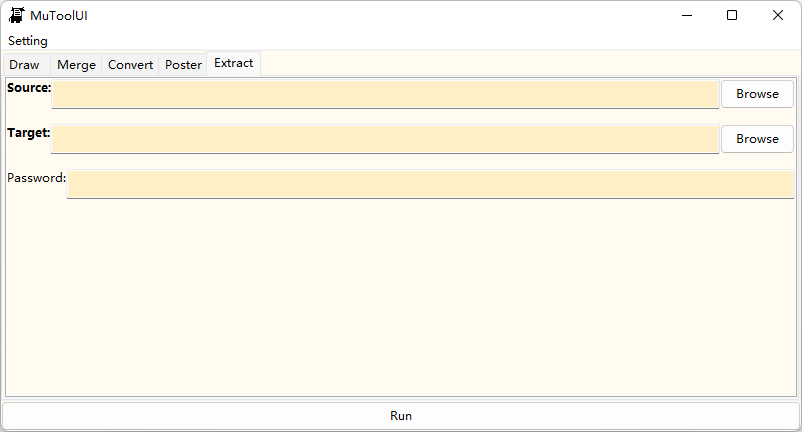

[English](./README.md) | 中文
# MutoolUI

## 这是什么？
这是一款基于Mutool实现的PDF处理软件，支持PDF格式转换、生成图片、合并PDF、海报分割等功能。

最初是我因为总记不住Mutool指令而开发的。但后来我发现一款更好用的PDFgear，所以这个项目就有些“烂尾”了。

还是推荐使用PDFgear。

## 使用
安装：在release中查看；或者Windows下提前将liblcl.dll、mutool.exe放到bin下，运行build.bat即可在app目录下找到。

目前支持Windows、Linux。至于Mac……自己编译看看，我是不会提供Mac版本的。

使用总体上很简单，不会用看应用内帮助。

粗体字是必填项，其他是选填。跟着框中提示操作。

## 展示

## 项目地址
Github：<https://github.com/skyqvn/MutoolUI>

Gitee：<https://gitee.com/skyqvn/mutool-ui>
